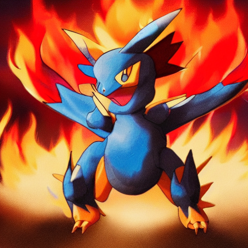
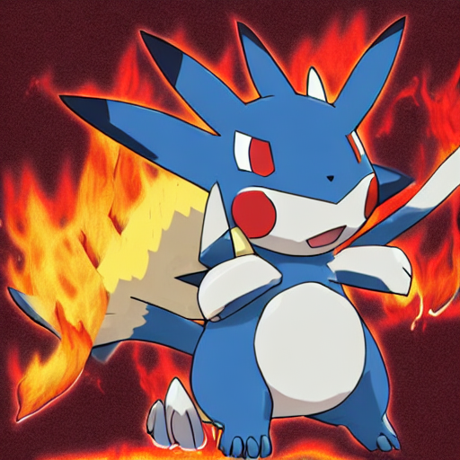

# generative_fine_tuning

## Overview

The 'generative_fine_tuning' project enables personalized generative AI pipelines using text-to-image with LORA (Low-Rank Adaptation of Large Language Models). This approach utilizes a text-to-image training script from the 'diffusers' library and incorporates LORA to train generative AI models more efficiently and with fewer resources. The core idea behind this approach is to freeze the pre-trained model weights and introduce trainable rank decomposition matrices into each layer. For more detailed information, refer to the following resources:

* https://paperswithcode.com/paper/lora-low-rank-adaptation-of-large-language
* https://github.com/huggingface/diffusers/tree/main/examples

## How to train the model

To train the model, follow these steps:

* Open the "text_to_image_LORA.ipynb" file located in the Notebooks folder.
* Install the necessary dependencies.
* Log in to your Hugging Face account.
* Prepare the LORA script for training.
* Test the inference capabilities of the model.

Please note that training the model requires a GPU. You can utilize the free GPUs provided by Google Colab for this purpose.

## Sample input and output

Input

```
# Init pipeline
pipe = PokemonPipeline(
    model_base="CompVis/stable-diffusion-v1-4",
    model_trained="/content/gdrive/MyDrive/AI_dreams/sd-pokemon-model"
    )
```

```
# Run inference
image = pipe(
        "A pokemon with blue eyes, red skin, winds and fire type", scale=0.5
    )
```

Output



```
# Run inference
image = pipe(
        "A pokemon with blue eyes, red skin, winds and fire type", scale=0.5
    )
```

Output



## Training dataset
The chosen dataset for this project is the "pokemon-blip-captions" dataset, which can be accessed on Hugging Face at the following link:

https://huggingface.co/datasets/lambdalabs/pokemon-blip-captions

## Model complexity
The complexity of the model can be determined using the following code:

```
pipe.model.unet.num_parameters(only_trainable=True)
# trainable parameters: 860,318,148
```

## Evaluation metric
The evaluation metric used in this project is the Mean Square Error (MSE) loss. It measures the average squared difference between the predicted values and the corresponding true values. MSE quantifies the average "error" or "deviation" between the predicted values (y_pred) and the ground truth values (y_true). The MSE loss is calculated by taking the mean of the squared differences between each predicted value and its corresponding true value.

```
Steps: 100% 50/50 [mse_loss=0.0281]
```

## Trained model

* Trained model is located in "texttoimage/sd-pokemon-model"

## API

Is was created an API with the purpose of handle the txt2img pipeline (PokemonPipeline)
